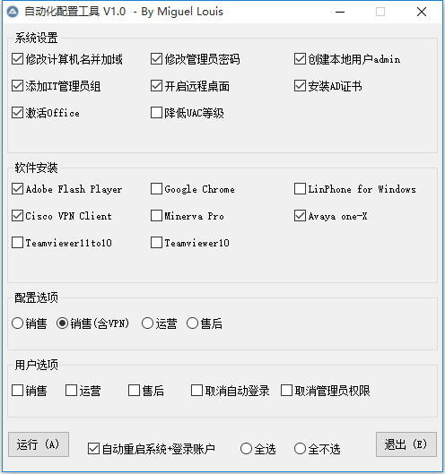

#### 关于Helpdesk_Automatic_configuration_Tool

Helpdesk_Automatic_configuration_Tool是一款Helpdesk桌面运维自动化配置的工具，由类BASIC语言的AutoIt v3 脚本编写，用于简化Helpdesk大量繁复的操作，通过GUI交互，实现以下功能，大幅解放Helpdesk桌面工程师的时间和精力，用于更高的技术学习和提升。
1. 自动设置系统选项
2. 客户端自动加域
3. 自动安装软件
4. 自动重启电脑并登录域账户
5. 自动配置桌面环境
6. 自动配置outlook及skype等

#### 配置说明：

以下代码位于173 ~ 187行，user-defined部分请根据实际需求和场景自定义

Global $rootUserName = "administrator" ;本地管理员administrator
Global $rootPassword = "user-defined"  ;本地管理员密码

Global $createUserName = "admin"  ;创建本地用户名
Global $createUserPassword = "user-defined" ;设置本地用户名密码

Global $domainName = "user-defined" ;AD域名，
Global $itUserName = "user-defined" ;IT管理员域账户
Global $itPassword = "user-defined" ;IT管理员域账户密码

Global $fileSrvPath = "user-defined" ;安装文件所在的共享目录地址

Global $userName	 ;用户域账号
Global $userPassword ;用户域账户密码
Global $hostName     ;用户计算机名

#### 使用说明：

1. 该自动化运维工具适用于Microsoft Windows 7、Windows 8、Windows 10系统，结合企业级系统部署平台MDT使用更优
2. 配置选项用于根据不同部门员工的桌面使用需求自动进行系统设置、安装软件等初始化操作，需在administraor账户下运行
3. 用户选项用于根据不用部门员工的桌面使用需求自动进行桌面环境配置，outlook、skype等办公软件登录设置，需在用于账户下运行
4. 自动重启系统+登录账户 通过授予用户本地管理员权限并修改注册表实现，在系统重启自动登录用户账户后，需运行取消自动登录 和 取消管理员权限来重置注册表并从administrators组移出用户账户
5. 可根据各自公司内部的实际桌面运维需求，修改该脚本代码，从而添加、修改或删除自动化功能模块
6. 所需安装的软件和工具下载放置于$fileSrvPath下，并根据存放路径和软件名称修改对应模块的代码

#### 技术支持：

QQ: 3251076037